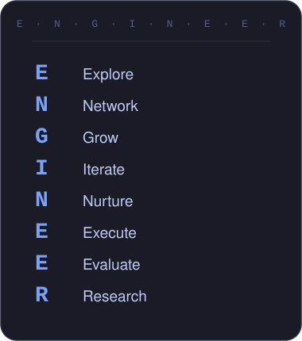

# Hi, I'm an E · N · G · I · N · E · E · R

### AI that helps. Software that ships.

B.E. Electronics & Computer Engineering, Thapar Institute of Engineering & Technology (Patiala) · Class of 2027 · URF Awardee FY25-26 
Federated Learning · Full-Stack Systems · Assistive Tech

 

## 🧰 Tech Stack

<table width="100%">
<tr>
<td width="35%" valign="top" align="center">

</td>
<td width="65%" valign="top">

**Languages**
 

**AI / ML**
 

**Web & Full-Stack**
 

**Data & Cloud**
 

**Tools**
 

</td>
</tr>
</table>

 

## 🚀 Featured Work & Research

### Siddhi — Full-Stack Placement Intelligence Agent
*Next.js · TypeScript · PostgreSQL · Prisma · Playwright · Gmail & Telegram APIs*

- Self-hosted agent that reads Gmail, scrapes a placement portal, and sends tiered deadline reminders — three-runtime architecture (Vercel / GitHub Actions / local worker) built to work around Cloudflare Turnstile.
- Idempotent sync pipeline, AES-256-GCM encrypted credentials, and 44 passing automated tests.

### Federated Learning for ICU Mortality Prediction
*PyTorch · TensorFlow · HuggingFace Transformers · Flower*

- Research (Washington State University, Sep 2025 – Mar 2026) replicating and extending FLICU on the real eICU database — a three-branch FixedFusionNet (BiLSTM + TF-IDF + note-type) across 10,000 ICU patients from 140 hospitals.
- Best configuration (FixedFusionNet + FedProx) reached AUROC 0.7406 (120/217 deaths detected); a proposed local weighted-BCE correction cut per-hospital variance by 32.4% vs. FedAvg. Currently under review at IEEE Transactions on Dependable & Secure Computing.

### Grade Change Intelligence — Honeywell Campus Connect Hackathon
*Python · LightGBM · scikit-learn · Streamlit*

- Five-phase ML system forecasting off-spec paper quality ~3 minutes ahead (median 75s lead time) — precision 0.96 / recall 0.89 / ROC-AUC 0.984.
- Ablation-proved causal feature, de-trended a coordinated-ramp confound, and a prescriptive optimizer scored against a physics simulator.

### Little'Learners — Assistive Learning Platform
*Computer Vision · NLP · AR*

- AI Engineer & Head of Planning/Outreach for a CV + NLP + AR learning platform for children 4–12 with dyslexia, dyscalculia, and dysgraphia — leading a team across India, California, and Zurich.
- 🏆 1st place, InovateX (campus AI platform competition).

### Invisible Watermarking Attacks
*GAN · CNN · Adversarial ML*

- ELC research (Summer 2025, Thapar Institute) on black-box adversarial attacks against StegaStamp, InvisMark, TreeRing, and StableSignature.
- Achieved a 71.4–79.86% watermark removal rate across the four systems.

### Other Builds
- **Course Tracker** — zero-backend, local-first video progress tracker (Next.js, React, TypeScript) that solves fuzzy caption-matching across inconsistent file naming.
- **Meter Reading Annotator** — Streamlit OCR training-data pipeline built for a PSPCL Punjab capstone platform that's consolidating billing, fraud detection, and OCR/YOLO pipelines — currently split across three vendor systems — into one unified database and dashboard.
- **Modern Monopoly** — MERN business-simulation game with an RL bot opponent; core engine complete, RL bot and UI in progress.
- **Create'n'Conquer** — 🥉 3rd place; built an egocentric data pipeline.
- **[Printing Press Client Site](https://dharamyugpress.com)** — live production website built and deployed end-to-end for a real client.

 

### 📄 Publications

| Title | Venue | Role | Result |
|---|---|---|---|
| Enhancing Strabismus Diagnosis from Detection to Classification with Deep Learning | AIMLA 2025 | Published | 92% accuracy (EfficientNet, ResNet, VGGNet) |
| Pixels Meet Words *(CrisisMMD informativeness classification, ViT-B16+BERT)* | I2ITCON 2026 | 1st author | 85% accuracy (F1 0.81, AUC 0.892) |
| DisasterNet *(CrisisMMD damage-severity classification, TPF+MBT)* | CVIP 2025 | Co-author | 80.95% accuracy (+8 pts over prior SOTA) |
| MOSAIC *(cultural-knowledge-graph-guided multimodal fusion)* | THEC 2025 | 1st author | — |
| From Classroom to Cubicle — Career Catalyst Transformation Model | THEC 2025 | 2nd author | — |
| CrisisStream *(real-time CrisisMMD triage)* | TICSR'26 | 1st author, abstract | ≤2s latency |

 

## 🎨 Beyond the Code

<table width="100%">
<tr>
<td width="60%" valign="top">

When I'm not shipping code or running experiments, I'm usually organizing something — workshops, hackathons, cultural fests, you name it. I mentor 300+ students a year through FROSH, Thapar's official mentorship society, and help run Saturnalia and URJA, our two biggest annual fests — managing ₹2.5L+ budgets and pushing turnout past 10,000.

</td>
<td width="40%" valign="top" align="center">

 <i>FROSH mentoring</i>
  

 <i>Saturnalia & URJA</i>
  

 <i>Campus society life</i>

</td>
</tr>
</table>

 

# 📫 Let's Connect

### Always open to interesting conversations — reach out.

